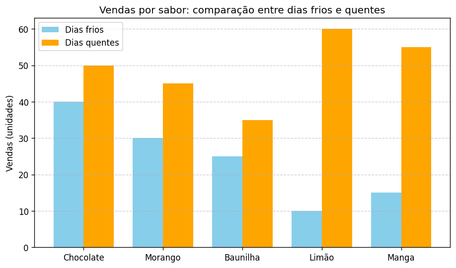

# 🍦 Prevendo Vendas de Sorvete com Machine Learning 📊

## 📌 Sobre o Desafio
Este projeto foi desenvolvido como parte do desafio **"Prevendo Vendas de Sorvete com Machine Learning"**.  
O objetivo é aplicar conceitos de **Machine Learning** para prever as vendas de sorvete com base na **temperatura do dia**, ajudando sorveterias a planejarem melhor sua produção, reduzindo desperdícios e aumentando os lucros.

---

## 🎯 Objetivos
- ✅ Treinar um modelo de regressão para prever vendas de sorvete a partir da temperatura.  
- ✅ Registrar e gerenciar o modelo usando **MLflow**.  
- ✅ Implementar o modelo para previsões em tempo real em ambiente de cloud computing.  
- ✅ Criar um pipeline estruturado para garantir reprodutibilidade.  

---

## 🧪 Metodologia
1. **Coleta de dados**: foram utilizadas temperaturas médias e vendas diárias simuladas.  
2. **Pré-processamento**: divisão em treino e teste.  
3. **Treinamento**: modelo de **Regressão Linear**.  
4. **Avaliação**: métrica R² para medir a qualidade da previsão.  
5. **Registro**: uso do **MLflow** para versionamento do modelo.  
6. **Deploy**: criação de uma API simples com **FastAPI** para previsões em tempo real.  

---

## 📊 Resultados
- O modelo apresentou um **R² de aproximadamente 0.9**, indicando boa capacidade de previsão.  
- Observou-se que a cada aumento de **1°C**, as vendas crescem em média **X unidades** (valor obtido no treino).  

## 📊 Exemplos de gráficos

Relação entre temperatura e vendas:

Comparação de sabores em dias frios vs. quentes:
  

---
## 🔎 Análise dos Gráficos

### Relação entre Temperatura e Vendas
O gráfico de dispersão com a linha de regressão mostra uma **forte correlação positiva** entre a temperatura e as vendas de sorvete.  
Isso significa que, conforme a temperatura aumenta, a quantidade de sorvetes vendidos também cresce.  
Esse comportamento é esperado, já que em dias mais quentes os consumidores buscam alternativas refrescantes.  
O modelo de regressão linear conseguiu capturar bem essa tendência, apresentando um bom ajuste aos dados.

### Comparação de Sabores em Dias Frios vs. Quentes
O gráfico de barras evidencia diferenças importantes no consumo de sabores:
- **Chocolate e Morango** mantêm vendas consistentes em qualquer clima, mostrando serem sabores clássicos e de preferência estável.  
- **Limão e Manga** apresentam um salto expressivo em dias quentes, confirmando que sabores mais refrescantes são mais procurados no calor.  
- Em dias frios, sabores mais doces e encorpados (como Chocolate) continuam sendo os mais vendidos, mesmo com a queda geral no consumo.  

### Insights Gerais
- A cada aumento de temperatura, há um impacto direto e mensurável nas vendas.  
- Estratégias de marketing podem ser ajustadas conforme a previsão do tempo, destacando sabores refrescantes em dias quentes.  
- Em dias mais frios, promoções de sabores clássicos podem ajudar a manter o fluxo de clientes.  - Esse tipo de análise pode ser expandido com dados reais de clima e vendas, tornando o modelo ainda mais robusto.

---

### ⚠️ Aviso sobre uso de IA

Este conteúdo foi gerado com o auxílio de inteligência artificial — **Copilot** — e serve como material de apoio à documentação do projeto. A IA foi utilizada para estruturar textos, sugerir trechos e formatar o README, incluindo exemplos e prints simulados.

**Observações importantes**
- **Ferramenta usada:** Copilot (versão atual disponibilizada no ambiente).  
- **Revisão humana:** todo o conteúdo gerado pela IA foi lido, ajustado e validado por mim, **Cristiane Reindel**, antes da publicação.  
- **Responsabilidade:** decisões técnicas, adaptações do código e informações sensíveis devem ser conferidas com atenção humana; o material pode exigir ajustes para refletir seu ambiente e credenciais reais.  
- **Uso ético:** não compartilhe chaves ou segredos; verifique conformidade com políticas de privacidade e licenciamento antes de publicar ou distribuir dados.

**Cristiane Reindel**🦄
